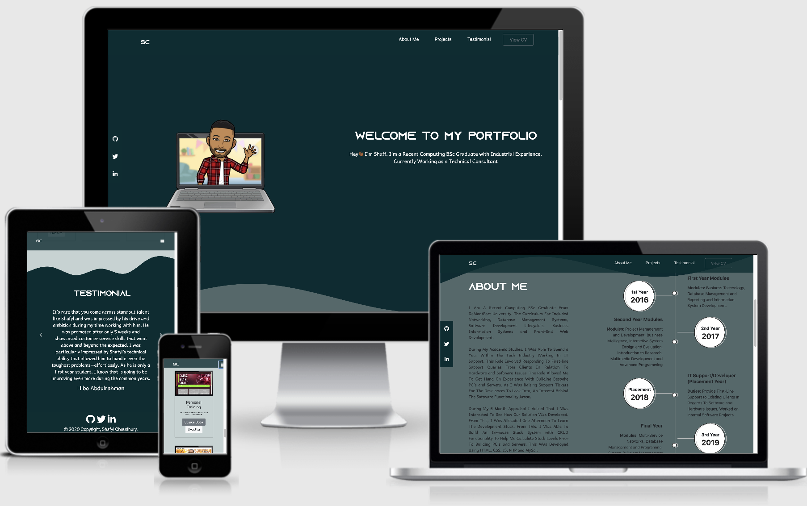

# Welcome to My First Milestone Project - Portfolio Website 

## Table of Contents

* [Purpose](#purpose)
*  [User Experience (UX) Design](#user-experience-ux-design)
* [Features](#features )
*  [Technologies Used](#technologies-used)
*  [Testing](#testing)
* [Issues Faced](#issues-faced)
* [Deployment](#deployment)
* [Future Development](#future-development)

## Purpose
This website is ultimately developed to showcase previous work history and skill to recruiters and technical personnel. By doing this, it can allow for collaboration for consultancy and freelance projects. This creates a platform where all projects, social media and CV links can be displayed within a centralised location.
## Features
 - Demonstrate previous development projects
 - Detail working history 
 - Provide testimonials from previous employees (from Linkedin)
 - Provide social media links 
 - Download and view CV
 - Sticky Nav Bar
 - Sticky Social Media Icons
	 - Disabled at Mobile View
## User Experience (UX) Design

# User Stories

**First **Time** Visitor**

-	Idetify purpose of the website once site is opened
-	Navigate through sections in a timely manner 
-	Social Media platforms easily accessible to view social presence 
-	Review previous work history
-	Explore recent development projects
-	View testimonials from previous employees

**Returning **Visitor** Goals**
-	Monitor progress of development skills
-	View online CV
	-	Collect contact infomation 
	- Download CV
-	Identify updates on timeline section
-	Further examine social media content

 ## Design 
 ### Color Scheme
-	Prior tot he development of the project, i created a palette on "coolors.co". The palette can be found below: 
		
 ### Font
-	Whilst browsing for fonts, I came across a font name called "Azonix" which was not available on popular online typography services i.e Google Fonts. This meant that i had to download the typography in a "OTF" format and use "@font-face" within the CSS. I chose this specific font as I think its aesthetically appealing and catches the users eye.
-	For the secondary font styling, I selected "Andika New Basic" with a fallback font of "sans-serif" These fonts are clean and professional
 ### Wireframe
 -	WIreframes where created prior to the develoment stages of the project. A tool called "Balsamiq" was used to provide a visual representation of how the website should look. Screenshots can be found below for each section:
	 -	<a href="assets/wireframes/landing_page.png"> Landing Page </a>
	-  <a href="assets/wireframes/about_me.png"> About Me </a>
	  - <a href="assets/wireframes/projects.png"> Projects </a>
	 -   <a href="assets/wireframes/testimonial.png"> Testimonial  </a>
 

## Technologies Used
### Languages:
 1. HTML 
 2. CSS 
 3. Bootstrap  
 
 ### Resources Used:
  -   <a href="https://getwaves.io/"> Get Waves  </a>
		  -	This tool was used to generate an SVG for the curved backgrounds of the website.
	-   <a href="https://coolors.co/"> Coolors </a>
			- Online color scheme allowed to create a palette of colors which was used for the website
	-  <a href="https://www.bitmoji.com/"> Bitmoji</a>
			- Online tool for a personal emoji
	-   <a href="https://fontawesome.com/"> Font Awesome</a>
			- This tool provided icons throughout the website to aid UX
	-   <a href="https://getbootstrap.com/docs/4.1/getting-started/introduction/"> Bootstrap Documentation </a>
			- Documentation provided code for the components of the website such as card stack for layout of projects section	
-  <a href="https://codepen.io/Washable/pen/Oxqjbq"> Code Pen</a>
			- Provided code snippet for carousel for the testimonial section
-  <a href="https://mdbootstrap.com/snippets/jquery/ascensus/1727054#css-tab-view"> MD Bootstrap</a>
			- Provided code snippet for sticky navbar
-  <a href="https://scalablecss.com/setup-custom-fonts-with-font-face/"> Scalable CSS</a>
			- Detailed how to implement custom fonts using the "@font-face" element
-  <a href="https://www.bootdey.com/snippets/view/bs4-my-experience-timeline#html"> Boot Dey</a>
			- Provided code snippet for timeline section

		
 

 
## Testing
## Issues Faced
## Deployment
## Future Development
## Credits
	
 
