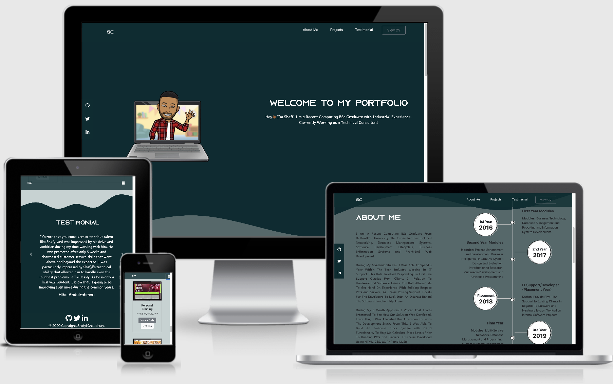
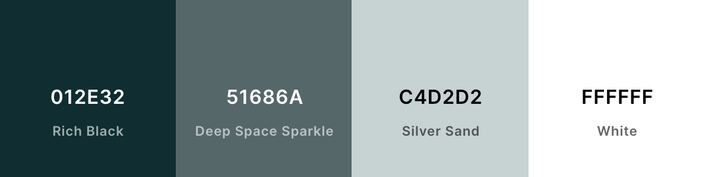
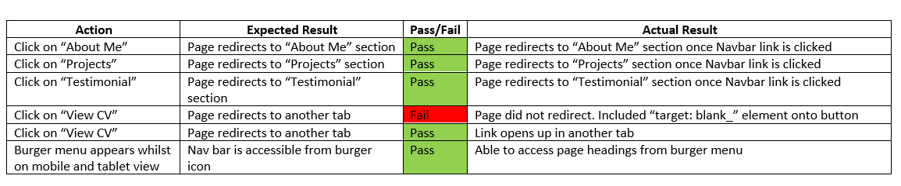
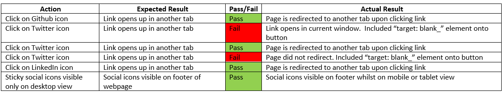
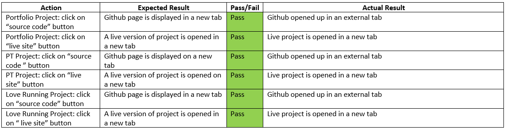
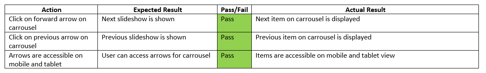

# Welcome to My First Milestone Project - Portfolio Website 


# Table of Contents

* [Purpose](#purpose)
*  [User Experience (UX) Design](#user-experience-ux-design)
* [Features](#features )
*  [Technologies Used](#technologies-used)
*  [Testing](#testing)
* [Issues Faced](#issues-faced)
* [Deployment](#deployment)
* [Future Development](#future-development)


# Purpose
This website is ultimately developed to showcase previous work history and skill to recruiters and technical personnel. By doing this, it can allow for collaboration for consultancy and freelance projects. This creates a platform where all projects, social media and CV links can be displayed within a centralised location.
# Features
 - Demonstrate previous development projects.
 - Detail working history.
 - Provide testimonials from previous employees (from Linkedin).
 - Provide social media links.
 - Download and view CV.
 - Sticky Nav Bar.
 - Sticky Social Media Icons.
	 - Disabled at Mobile View.
# User Experience (UX) Design
## Strategy
My objective for this website is to allow potential recruiters and tech personnel to view work history and projects. The website aims to attract the end user and to contact for opportunities.

## Scope
The website was developed to exclusively showcase potential in software development. The landing page was designed to allow personnel instantly understand concept of the website. This website will provide history of employment and display previous development projects. Relevant links would be provided to live projects and social media platforms to view social presence.

## Structure 
The website was designed as a single page application  (SPA). The reasoning behind this is that users don't tend to have much time on their hands, so a SPA make all content easily visible and gets straight to the point without navigating through multiple pages. The "View CV" was designed to capture the eye of the user to view contact information written within the CV.
## Skeleton
Wireframes where created to allow a visual representation of the layout of the website. This aided the development to ensure content is placed correctly. 
-	A tool called "Balsamiq" was used to provide 
		wireframes for the website, screenshots can be found below for each section:
	 -	<a href="assets/wireframes/landing_page.png"> Landing Page </a>
	-  <a href="assets/wireframes/about_me.png"> About Me </a>
	  - <a href="assets/wireframes/projects.png"> Projects </a>
	 -   <a href="assets/wireframes/testimonial.png"> Testimonial  </a>

# User Stories

**First **Time** Visitor**

-	Identify purpose of the website once site is opened.
-	Navigate through sections in a timely manner.
-	Social Media platforms easily accessible to view social presence. 
-	Review previous work history.
-	Explore recent development projects.
-	View testimonials from previous employees.

**Returning **Visitor** Goals**
-	Monitor progress of development skills.
-	View online CV.
	-	Collect contact information.
	- Download CV.
-	Identify updates on timeline section.
-	Further examine social media content.

 # Design 
 ## Color Scheme
-	Prior tot he development of the project, i created a palette on "coolors.co". The palette can be found below: 
		
 ## Font
-	Whilst browsing for fonts, I came across a font name called "Azonix" which was not available on popular online typography services i.e Google Fonts. This meant that i had to download the typography in a "OTF" format and use "@font-face" within the CSS. I chose this specific font as I think its aesthetically appealing and catches the users eye.
-	For the secondary font styling, I selected "Andika New Basic" with a fallback font of "sans-serif" These fonts are clean and professional.

# Technologies Used
### Languages and Framework Used:
 1. HTML 
 2. CSS 
 3. Bootstrap  
 
 # Other Resources Used:
 1.	 <a href="https://getwaves.io/"> Get Waves  </a>
		  This tool was used to generate an SVG for the curved backgrounds of the website.
2.  <a href="https://coolors.co/"> Coolors </a>
			Online color scheme allowed to create a palette of colors which was used for the website.
3. <a href="https://www.bitmoji.com/"> Bitmoji</a>
			Online tool for a personal emoji
4. <a href="https://fontawesome.com/"> Font Awesome</a>
			This tool provided icons throughout the website to aid UX.
5.	<a href="https://getbootstrap.com/docs/4.1/getting-started/introduction/"> Bootstrap Documentation </a>
			Documentation provided code for the components of the website such as card stack for layout of projects section.
6.	 <a href="https://git-scm.com/"> Git</a>
		Git was used for version control by utilizing the Gitpod terminal to commit to Git and Push to GitHub.
7.	 <a href="https://github.com"> GitHub</a>
		Git was used for version control by utilizing the Gitpod terminal to commit to Git and Push to GitHub.
8.	 <a href="https://balsamiq.com/"> Balsamiq</a>
	Balsamiq was used to create the  wireframes during the design process.
9. <a href="http://ami.responsivedesign.is/"> Am I Responsive </a>
	Used to check website responsiveness across variety of different device types. 
10. <a href="https://gitpod.io/"> GitPod IDE</a>
	IDE (Integrated Development Environment), for writing, editing and saving code.
# Testing
### HTML
HTML was validated with <a href="https://validator.w3.org/"> Validator w3. </a> The first attempt to validate HTML contents produced 6 errors. This was due to "the element button must not appear as a descendant of the a element". This error occured as I was using buttons within "a" tags. Listed error messages can be found here:
<a href="assets/README_img/errors.png"> HTML Validation Errors </a>
-	After applying fixes to HTML:
	-	<a href="assets/README_img/fix.png"> HTML Validation Fixed </a>
### CSS
CSS was validated with <a href="https://validator.w3.org/"> Validator w3. </a> CSS did not produce any validation errors:
<p>
    <a href="http://jigsaw.w3.org/css-validator/check/referer">
        
    </a> </p>

## Responsiveness
To test the responsiveness of the site I used [Chrome DevTools](https://developers.google.com/web/tools/chrome-devtools), [Responsive Design Checker](https://www.responsivedesignchecker.com/) and [BrowserStack](https://www.browserstack.com/).
	 

 - Chrome DevTools
	 - This tool was used throughout development to test and debug code.
- Responsive Design Checker
	- Online tool which provided testing against websites scalability across device dimensions.
- BrowserStack
	- Provided the platform to test website across different browsers
## Test Cases
All tests have been completed using the previous tools mentioned within the previous section. The website has been tested across several devices and browsers. The below segment details the use cases of the website being tested against its expected functionality compared to the actual results. Whilst there wasn't any major issues found, I have highlighted issues faced.
### Navbar 


### Social Links


### Project Section


### Carousel 


## Testing User Stories
**First **Time** Visitor**

-	Identify purpose of the website once site is opened.
	-	Landing page provides clear message of purpose of website 
-	Navigate through sections in a timely manner.
	-	Navbar provides links to relevant sections with lag
	-	Sticky navbar enabled when scrolling through website 
-	Social Media platforms easily accessible to view social presence. 
	-	Each social icon display in a new tab
	-	Social icons visible on sticky nav bar and included within footer section whilst on mobile and tablet
-	Review previous work history.
	-	Details provided within timeline section of website 
-	Explore recent development projects.
	-	Most recent project displayed under projects section
-	View testimonials from previous employees.
	-	Carousel included with recommendations from Linkedin account

**Returning **Visitor** Goals**
-	Monitor progress of development skills.
	-	Project section includes most recent development projects
-	View online CV.
	-	CV can be accessed under the "View CV" button on navbar
-	Identify updates on timeline section.
	-	Users can view timeline events under timeline section
-	Further examine social media content.
	-	Social media links provided 

# Issues Faced
### Sticky Nav Bar 
Due to overlaying CSS styling, the sticky navbar can only be accessed at certain viewpoints. This can be identified when the hover effect is disabled, making the social media icons inaccessible. This could be potentially rectified by making changes to other elements to stop overlapping.
	- <a href="assets/README_img/overlapping.png"> Overlapping Issue </a>
	- <a href="assets/README_img/socials.png"> Without Overlapping Issue</a>
### Mobile Devices 
 Website works well on iPhone X however on other devices background for sections are longer then needed, for example on  <a href="assets/README_img/iphone.png"> iPhone X</a> the svg and view height are aligned correctly, but the media query for small devices such as Galaxy s5 provides a huge space in the about me section as seen  <a href="assets/README-img/issue.png"> here</a> . I have tried adjusting the viewing height for this media query but it affects other small devices differently. I believe this can be resolved by creating more specific media queries which essentially make the website more responsive.
 
### Carousel 
Bootstrap's documentation initally provided a snipped for a carousel but caused a bug on mobile view. The carousel caption would be placed in the projects section instead of the testimonial section, a screenshot can be found  <a href="assets/README_img/testimonial_issue.png"> here </a> .
# Deployment
### Github

1.  Log into Github and Locate the relevant repository. Here is a  [link](https://github.com/shaff600/Portfolior)
2.  Click on the settings buttons on the horizontal menu
3.  Scrolling down until you reach "Github pages"
4.  There is a heading named "Source". There is a button underneath it. Click on that button and change it from "none" to "main". Then click "save"
5.  You will have to scroll down to the heading "Github Pages". The published  [site](https://github.com/shaff600/Portfolio)  with the link should be there.

### Forking the Repository

You can fork the repository through the following steps. Forking the repository means you will have a copy of the repository and any changes you make will not affect the original repository.

1.  Log in to GitHub and locate the GitHub Repository. Here is a link for the  [repository](https://github.com/shaff600/Portfolio)
2.  At the top of the Repository (not top of page) just above the "Settings" Button on the menu. Looking towards the right of the page. Locate the button "Fork" then click
3.  You should now have a copy of the original repository in your GitHub account

### Local Clone

This is used when you would like to make changes to the project code

1.  Should you wish to use a different IDE like VSCode. You first log in to Github and locate the required repository. Here is the link for this  [repository](https://github.com/shaff600/Portfolio)
2.  Open a new terminal on Git Bash
3.  Type  `git clone`, and then paste the URL you copied

```
$ git clone https://github.com/shaff600/Portfolio

```

Here is a link that can explain this process further.  [Click Here](https://help.github.com/en/github/creating-cloning-and-archiving-repositories/cloning-a-repository#cloning-a-repository-to-github-desktop)
# Future Development
In order to make the website a more user friendly platform, the website shortcomings detailed within the [Issues Faced](#issues-faced) section would have to be resolved. A deeper understanding of media queries and the Bootstrap grid system will help identify reasonings of css elements overlapping and allow for a more responsive site. 
# Credits
-  <a href="https://codepen.io/Washable/pen/Oxqjbq"> Code Pen</a>
			- Provided code snippet for carousel for the testimonial section.
-  <a href="https://mdbootstrap.com/snippets/jquery/ascensus/1727054#css-tab-view"> MD Bootstrap</a>
			- Provided code snippet for sticky navbar.
-  <a href="https://scalablecss.com/setup-custom-fonts-with-font-face/"> Scalable CSS</a>
			- Detailed how to implement custom fonts using the "@font-face" element
-  <a href="https://www.bootdey.com/snippets/view/bs4-my-experience-timeline#html"> Boot Dey</a>
			- Provided code snippet for timeline section.
-  <a href="https://www.w3schools.com/howto/howto_css_sticky_social_bar.asp"> w3schools</a>
			- Provided code snippet to create a sticky social bar.
-  <a href="https://getbootstrap.com/docs/4.0/components/card/"> Bootstrap Documentation</a>
			- Provided code snippet to create cards for project section.
			
			
 
